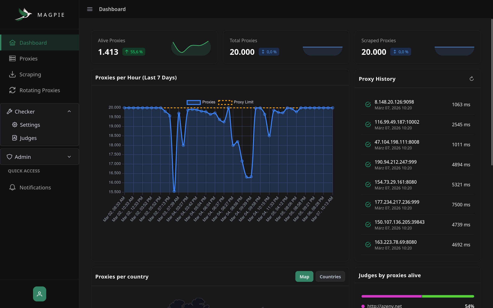
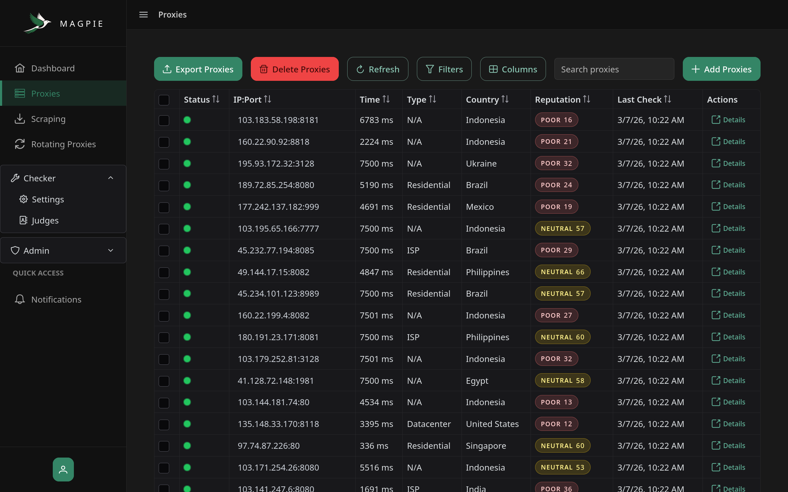
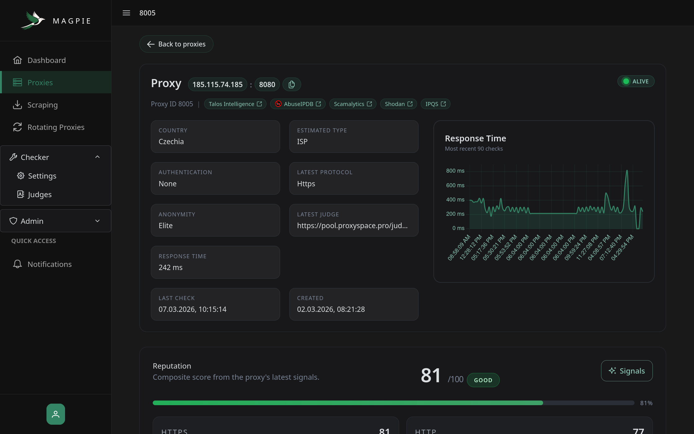
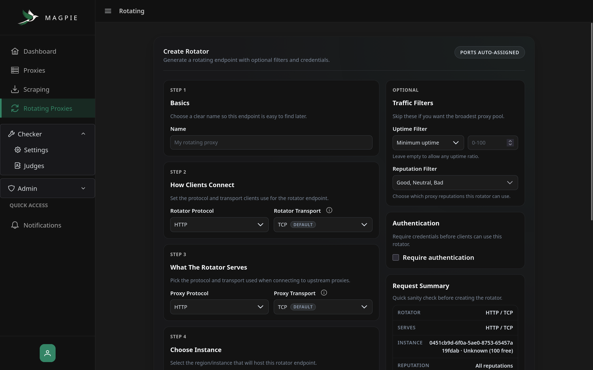
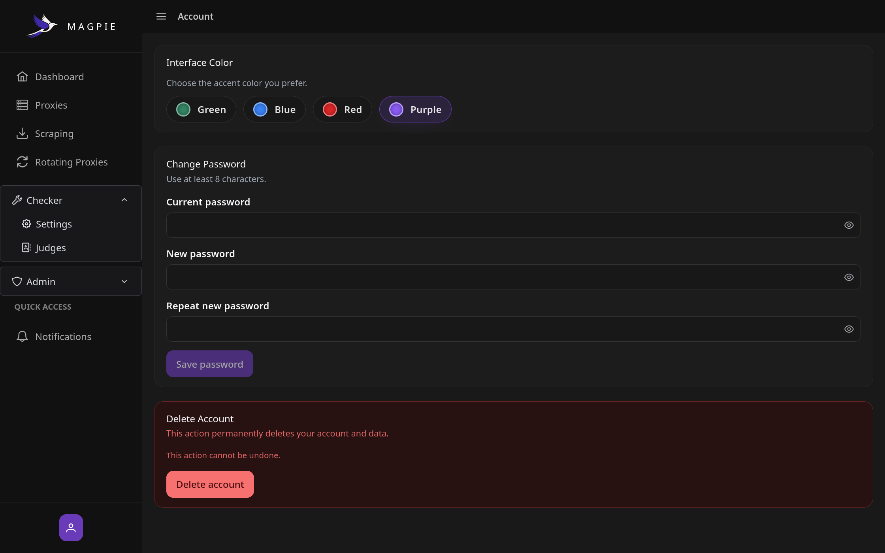

<div align="center">
  
  <h1>MAGPIE</h1>
  <p><strong>Multi-user AIO Proxy Manager</strong></p>
</div>

<div align="center">
  
  
  <a href="https://discord.gg/7FWAGXzhkC">
      
  </a>
  <br>
  
  


[//]: # (  )
</div>

---

Magpie is a self-hosted proxy manager that turns messy proxy lists into something you can actually use: 
- it scrapes proxies from public sources
- continuously checks which ones are alive
- filters out dead/bad entries
- assigns each proxy a reputation score (uptime/latency/anonymity)
- lets you create your own rotating proxy endpoints from the healthy pool

all via a web dashboard.

<details>
    <summary>Screenshots</summary>
    
    
    
    
    
</details>

## Features
- Multi-user
- Auto-scraping
- Proxy Checking / Health checks
- Reputation & filters
- Rotating proxy endpoints
- Dashboard + API
- Application protocols support (HTTP, HTTPS, SOCKS4, SOCKS5)
- Transport protocols support (TCP, QUIC/HTTP3)

## Quick Start

1. **Install Prerequisites:**
    - [Docker Desktop](https://www.docker.com/) (or Docker Engine + Compose)

2. **One-command install (recommended)**

   **macOS/Linux**:
   ```bash
   curl -fsSL https://raw.githubusercontent.com/Kuucheen/magpie/refs/heads/master/scripts/install.sh | bash
   ```
   If you see a Docker socket permission error on Linux, the installer will try to use `sudo` for Docker commands (you may be prompted).  
   Alternative fix: `sudo usermod -aG docker "$USER"` (then log out/in, or run `newgrp docker`).  
   Note: `sudo curl ... | bash` still runs `bash` as your user. Try `curl ... | sudo bash` instead.

   **Windows (PowerShell)**:
   ```bash
   iwr -useb https://raw.githubusercontent.com/Kuucheen/magpie/refs/heads/master/scripts/install.ps1 | iex
   ```

   This creates a `magpie/` folder with a `docker-compose.yml` and `.env`, then starts the stack.

3. **Proxy encryption key (important)** – Magpie uses `PROXY_ENCRYPTION_KEY` to encrypt stored secrets. Keep it stable between restarts/updates.

> [!WARNING]
> `PROXY_ENCRYPTION_KEY` locks all stored secrets (proxy auth, passwords, and ip addresses).  
> If you start the backend (or update to a new version) with a *different* key than the one used before, decryption fails and previously added proxies will not display or validate.  
> **Fix:** start the backend again using the **previous key** and everything works like before.  
> **Only rotate on purpose:** if you need a new key, export your proxies first.

4. **If you don't want to use the installer** 

    Requires [Git](https://git-scm.com/downloads)

   ```bash
   git clone https://github.com/Kuucheen/magpie.git
   cd magpie
   cp .env.example .env
   # edit .env and set PROXY_ENCRYPTION_KEY
   docker compose up -d
   ```
5. **Dive in**
    - UI: http://localhost:5050
    - API: http://localhost:5656/api  
      Register the first account to become the admin.

For geo lookups, create a [MaxMind GeoLite2 account](https://dev.maxmind.com/geoip/geolite2-free-geolocation-data) and generate a License Key. Enter it in the dashboard (Admin → Other) to enable automatic database downloads and updates.

### Updating
Use the helper scripts to pull the latest code and rebuild just the frontend/backend containers.

- **If you used the one-command installer**:
  - **macOS/Linux**: 
      ```bash
      curl -fsSL https://raw.githubusercontent.com/Kuucheen/magpie/refs/heads/master/scripts/update.sh | bash
      ```
      If you see a Docker socket permission error on Linux, the updater will try to use `sudo` for Docker commands (you may be prompted).
  - **Windows (PowerShell)**: 
      ```bash
      iwr -useb https://raw.githubusercontent.com/Kuucheen/magpie/refs/heads/master/scripts/update.ps1 | iex
      ```

- **If you cloned the project**:
  - **macOS/Linux**:
    ```bash
    ./scripts/update-frontend-backend.sh
    ```
  - **Windows (Command Prompt)**:
    ```bash
    scripts\update-frontend-backend.bat
    ```
    Double-click the file or run it from the repo root.

## Local Development
- Services: `docker compose up -d postgres redis`
- Backend: `cd backend && go run ./cmd/magpie`
- Frontend: `cd frontend && npm install && npm run start`

Magpie targets Go 1.24.x, Angular 20, PostgreSQL, and Redis. Keep those versions handy for parity.

## Attributions & External Sources
- [AbuseIPDB](https://www.abuseipdb.com/) — logo used with permission when linking to their site.

## Community
- Discord: https://discord.gg/7FWAGXzhkC
- Issues & feature requests: open them on GitHub.

## License
Magpie ships under the **GNU Affero General Public License v3.0**. See `LICENSE` for the full text. Contributions are more than welcome.
